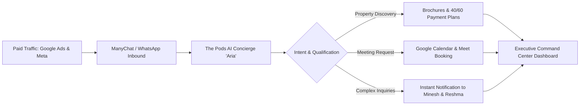

# THE PODS REAL ESTATE — AI CONCIERGE & COMMAND CENTER
## Official Production Handover & Operations Dossier

---

**Client:** Minesh Patel & Reshma Patel  
**Organization:** The Pods Real Estate (`@thepodsrealestate`)  
**Project:** The Pods AI — WhatsApp Concierge & Executive Command Center  
**Production URL:** [https://the-pods-ai.vercel.app](https://the-pods-ai.vercel.app)  
**Handover Date:** August 27, 2026  
**Status:** 🟢 **Production Live & Deployed**  

---

## 1. Executive Summary

**The Pods AI** is an enterprise-grade, autonomous real estate intelligence platform engineered specifically for **The Pods Real Estate** (Bluewaters Island, Dubai & Mayfair, London). 

The platform bridges top-of-funnel paid advertising traffic (Google Ads & Meta Ads) directly into high-conversion WhatsApp conversations, qualifies High-Net-Worth (HNW) investors in real time, automatically schedules VIP video and in-person consultations into Minesh Patel's Google Calendar, and delivers real-time portfolio analytics through a dedicated Command Center.

---

## 2. Platform Architecture & Tech Stack

| Layer | Technology | Purpose |
|---|---|---|
| **Frontend Framework** | **Next.js 16 (App Router) + Turbopack** | High-performance server-rendered UI and dynamic streaming API endpoints |
| **Language & Types** | **TypeScript 5.x** | Strict end-to-end type safety across data schemas and external APIs |
| **Database & ORM** | **PostgreSQL (Supabase) + Prisma ORM** | Scalable relational storage for Leads, Conversations, Messages, Bookings, and System Events |
| **Styling & Design** | **Tailwind CSS + Lucide Icons** | Ultra-luxury dark-mode executive aesthetic tailored for HNW real estate presentations |
| **AI LLM Engine** | **OpenAI GPT-4o-mini (JSON Mode)** | Sub-second, contextual luxury concierge responses with strict structured JSON schema |
| **Voice Processing** | **OpenAI Whisper-1** | Automatic voice note transcription for WhatsApp audio inputs |
| **Google Ads API** | **`google-ads-api` (v17/v18)** | Live GAQL integration querying actual AED spend, clicks, impressions, and conversions |
| **Meta Graph API** | **Facebook Graph API (v21.0)** | Live spend and lead synchronization for Instagram & Facebook campaigns |
| **Calendar Automation** | **Google Calendar API v3** | Service Account RS256 JWT auth with Domain-Wide Delegation + Google Meet generation |
| **Email Infrastructure** | **Resend REST API** | Transactional instant executive email alerts for VIP bookings and human handoffs |

---

## 3. Core Capabilities & Subsystems

### 3.1. AI WhatsApp Concierge ("Aria")
* **Personality:** Aria texts like a seasoned, luxury real estate consultant — direct, warm, concise, and grounded (never sends robotic bullet points or artificial bot pleasantries).
* **Ad-Source Intelligence:** Aria automatically detects if a lead arrived via **Google Ads** or **Meta Ads** and opens the conversation naturally (e.g., *"Hey! Yeah for sure — are you based in Dubai or coming from overseas?"*) rather than asking robotic questions like *"Which property are you interested in?"*.
* **Dual-Mode Consultative Booking:**
  * **Mode A (Direct Time Request):** When a client requests a time (e.g., *"Can we meet Wednesday at 3 PM?"*), Aria qualifies whether they prefer an **Online Google Meet** or **In-Person at The Pods Bluewaters**, requests their email, and confirms the booking directly.
  * **Mode B (Browsing Schedule):** Provides Minesh Patel's direct live appointment calendar: `https://calendar.app.google/xGRVwZCTkrnZCypUA`.
* **Strict Mathematical Budget Adherence:** Aria enforces strict mathematical filtering. If a client requests properties under AED 1.5M, Aria *never* quotes properties above 1.5M.
* **Core Brand Incentives:** Seamlessly incorporates the **AED 20,000 Fine-Dining VIP Voucher** at The Pods Bluewaters and the **10-Year UAE Golden Visa** criteria for purchases of AED 2M+.
* **London Open House Awareness:** Pre-programmed for the **Danube Properties London Open House** (Thursday, Sept 3, 2026 at 44 Brompton Rd, Knightsbridge, London SW3 1BW) with automatic post-event lifecycle expiration.

---

### 3.2. Off-Plan Property Knowledge Catalog (40 Verified Projects)

The AI is natively equipped with verified pricing, handovers, payment plans, and PDF brochures across Dubai's top 3 master developers:

#### 1. Danube Properties (13 Projects)
* **Aspirz (Sports City):** Studios from AED 874K, 1-Beds from AED 1.119M (40/60 with 0.5% monthly).
* **Serenz (JVC):** Studios from AED 905K, 1-Beds from AED 1.289M (40/60 with 0.5% monthly).
* **Bayz 101 & Bayz 102 (Business Bay):** Luxury high-rises from AED 2.275M (1-Bed+Office) and AED 2.542M (Flex 1-Bed).
* **Breez & Oceanz (Maritime City):** Waterfront residences from AED 1.20M (Oceanz) and AED 1.35M (Breez).
* **Diamondz (JLT), Fashionz (JVT), Timez (DSO), Greenz (Academic City), Shahrukhz (SZR), Sparklz (Al Furjan), Sportz (Sports City - Sold Out).**

#### 2. Sobha Realty (16 Projects)
* **The Pinnacle & The Eden at Sobha Central (SZR / Jebel Ali First):** 1-Beds from AED 1.78M, 2-Beds from AED 2.5M (Walking distance to Jebel Ali Metro).
* **Riverside Crescent (Sobha Hartland II):** Towers 310, 320, 330 (from AED 1.63M), 340, 350, 360.
* **The Woods, The Willows & The Grove (Sobha Sanctuary, Dubailand):** Entry from AED 1.00M up to luxury villas.
* **Siniya Island (UAQ):** Yachtside Marina Residences (AED 1.31M) and Palm Grove Beach Villas (AED 10.75M).
* **Sobha City Abu Dhabi:** River Cove, The Terraces, The Orchard.

#### 3. Binghatti Developers (11 Projects)
* **Iconic Partnerships:** Mercedes-Benz Places (Downtown AED 8.88M / Meydan AED 1.35M), Burj Binghatti Jacob & Co (AED 8.2M).
* **Rolls-Royce Inspired Wraith (Al Jaddaf):** Studios from AED 799K, 1-Beds from AED 1.29M.
* **High-Yield Entry:** Skyflame (Majan AED 585K), SkyTerraces (Motor City AED 680K), Titania (Majan AED 679K), Vintage (Majan AED 674K), Luxuria (JVT AED 675K), Etherea (JVC AED 765K), Twilight (Al Jaddaf AED 1.19M).
* **6% Cash Discount Policy:** Programmed specifically for Titania, Vintage, and Twilight.

---

### 3.3. Multi-Channel Advertising & Attribution Engine

* **Google Ads Live Integration:**
  * Connects to Google Ads Customer Account: `1670553891` (*The Pods Real Estate*).
  * Automatically calculates metrics in native **AED** (`cost_micros / 1,000,000`).
  * Live Active Campaign: *Danube Open House London Awareness* (Spend: **AED 937.63**, Clicks: **349**, Impressions: **16,156**, Avg CPC: **AED 2.69**).
  * Clear architectural separation between **Cost-Per-Lead (CPL)** (0 when 0 leads) and **Cost-Per-Click (CPC)** (AED 2.69).
* **Meta Marketing API Integration:**
  * Prepared for Meta Ad Account `act_570749328966450` via permanent System User access token.
  * Real-time blended dashboard calculating **Total Digital Ad Spend**, **Blended CPL**, and **Blended CPC**.

---

### 3.4. Executive Command Center Dashboard

Access URL: [https://the-pods-ai.vercel.app/dashboard](https://the-pods-ai.vercel.app/dashboard)

1. **Executive Overview:** High-level KPI cards (Total Leads, AI Qualified Leads, Bookings, Active Spend, Blended CPL, Multi-Channel Progress Bars).
2. **Leads CRM:** Searchable, filterable investor table displaying phone numbers, country flags, budgets, timelines, purpose (Investment vs Personal), and direct WhatsApp deep-links.
3. **Live Conversations & Human Takeover:** Real-time chat feed with instant **AI Active / Human Takeover Toggle**. When human takeover is enabled, AI response generation is immediately suppressed for that lead.
4. **Calendar & Bookings:** Timeline of confirmed investor appointments with Google Meet links and location details.
5. **AI Executive Advisor:** Built-in conversational BI agent allowing Minesh and Reshma to query their portfolio in natural language (e.g., *"Which campaign is generating the highest CTR?"* or *"Summarize today's qualified leads"*).
6. **Security & CSV Export:** One-click CSV export and lead deletion protected by admin credentials.

---

## 4. Key Access Credentials & Endpoints Directory

> [!IMPORTANT]
> Keep this section secure. Store all private keys in your company password manager.

### 4.1. Web Application & Dashboard
* **Production URL:** `https://the-pods-ai.vercel.app`
* **Dashboard Login:** `https://the-pods-ai.vercel.app/login`
* **Admin Email:** `info@thepodsrealestate.ae`
* **Dashboard Passcode:** `MineshPods0070`
* **Session Security:** 7-Day Encrypted `HttpOnly` cookie with strict CSRF protection.

### 4.2. WhatsApp & ManyChat Webhook
* **Webhook URL:** `https://the-pods-ai.vercel.app/api/webhooks/whatsapp`
* **HTTP Method:** `POST`
* **Content-Type:** `application/json`
* **Authorization Header:** Configured with `MANYCHAT_WEBHOOK_SECRET`

### 4.3. Google Workspace & Calendar Integration
* **Primary Delegated User:** `info@thepodsrealestate.ae`
* **Secondary Fallback User:** `minesh@thepods.ae`
* **Google Appointment Calendar:** `https://calendar.app.google/xGRVwZCTkrnZCypUA`
* **Service Account:** `pods-calendar-bot@graphic-transit-506308-k5.iam.gserviceaccount.com`

### 4.4. Executive Notification Routing
* **Instant Executive Email Alerts:** Dispatched in real time via Resend API directly to `info@thepodsrealestate.ae`. Every VIP consultation booking and human handoff alert generates an instant HTML briefing containing the client's name, phone, scheduled time, Google Meet link, and 1-click dashboard access.
* **Mobile Push Alerts:** Minesh Patel and Reshma Patel receive instant notifications on their smartphones via the ManyChat Mobile App (iOS / Android) whenever a lead books or requests live human assistance.
* **Executive Contacts:** Minesh Patel (`+971 52 366 6495`) & Reshma Patel (`+971 52 399 9502`).

---

## 5. Operations & Runbook Guide

### 5.1. Adding / Updating Off-Plan Projects
To modify prices, handovers, or payment plans, update:
`knowledge/published/offplan_catalog.json`  
The changes will automatically propagate across both the AI Concierge and the Dynamic Brochure Generator (`/brochures/[slug]`).

### 5.2. How Human Takeover Works
1. When an investor asks to speak with Minesh, Aria sets status to `HANDOFF` and triggers an instant email + WhatsApp log alert.
2. Inside the **Conversations** tab, click **AI Active** to toggle it to **Human Control (Paused)**.
3. You can chat directly via WhatsApp. When ready to resume automated AI qualification, toggle it back to **AI Active**.

### 5.3. Checking Google Ads Live Sync
The dashboard automatically pulls live Google Ads metrics every time the page loads or refreshes. To test the API endpoint directly:
`GET https://the-pods-ai.vercel.app/api/integrations/ad-metrics?period=last_30d`

---

## 6. Sign-off & Handover Confirmation

| Role | Name | Signature / Status | Date |
|---|---|---|---|
| **Lead Developer** | AI Systems Architect | ✅ Deployed & Verified | Aug 27, 2026 |
| **Client / Owner** | Minesh Patel | _______________________ | Aug 27, 2026 |
| **Operations Lead** | Reshma Patel | _______________________ | Aug 27, 2026 |

*Official Handover Document generated for The Pods Real Estate AI Platform.*
